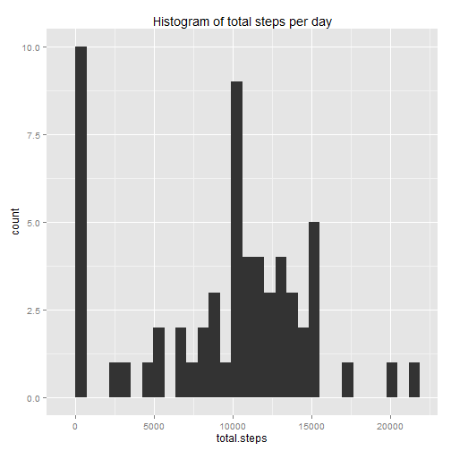
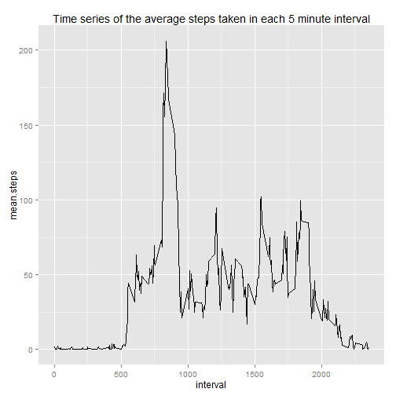
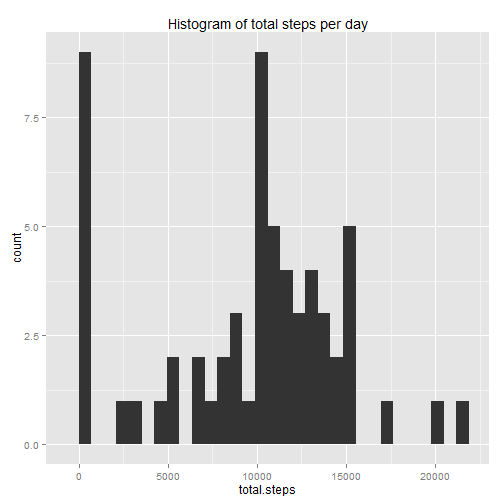
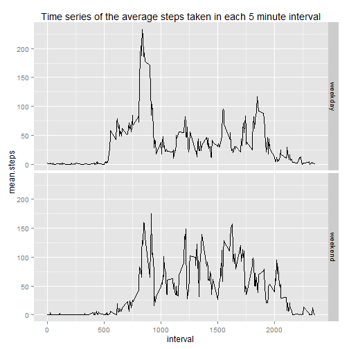

## Loading and preprocessing the data

```r
if(file.exists("activity.csv") == FALSE)
{
  unzip("activity.zip")
}
activity <- read.csv("activity.csv")

activity <- transform(activity, date = as.POSIXct(date, format="%F"))
```

## What is mean total number of steps taken per day?

```r
by.date <- group_by(activity, date)
daily.steps <- summarise(by.date, total.steps = sum(steps, na.rm = TRUE))
qplot(total.steps, data=daily.steps, geom="histogram") + labs(title = "Histogram of total steps per day")
```

```
## stat_bin: binwidth defaulted to range/30. Use 'binwidth = x' to adjust this.
```

 


```r
mean(daily.steps$total.steps, na.rm = TRUE)
```

```
## [1] 9354.23
```


```r
median(daily.steps$total.steps, na.rm = TRUE)
```

```
## [1] 10395
```


## What is the average daily activity pattern?

```r
by.interval <- group_by(activity, interval)
interval.activity <- summarise(by.interval, mean.steps = mean(steps, na.rm=TRUE))
qplot(interval, mean.steps, data=interval.activity, geom="line") + labs(title = "Time series of the average steps taken in each 5 minute interval")
```

 

### Which interval has the most activity?

```r
interval.activity[interval.activity$mean.steps == max(interval.activity$mean.steps), "interval"]
```

```
## Source: local data frame [1 x 1]
## 
##   interval
## 1      835
```

## Imputing missing values
Calculate the number of missing values (NAs)

```r
missing.ind <- is.na(activity$steps)
nrow(activity[missing.ind,])
```

```
## [1] 2304
```

The strategy to fill in the missing values is to use the mean of the 5 minute interval

```r
## duplicate the original dataset
activity.complete <- activity 

## impute missing values

activity.complete$steps <- ifelse(is.na(activity.complete$steps), interval.activity$mean.steps[interval.activity$interval == activity.complete$interval], activity.complete$steps)
```

Calculate the average daily activity pattern with imputed values

```r
by.date <- group_by(activity.complete, date)
daily.steps <- summarise(by.date, total.steps = sum(steps, na.rm = TRUE))
qplot(total.steps, data=daily.steps, geom="histogram") + labs(title = "Histogram of total steps per day")
```

```
## stat_bin: binwidth defaulted to range/30. Use 'binwidth = x' to adjust this.
```

 

Mean steps

```r
mean(daily.steps$total.steps, na.rm = TRUE)
```

```
## [1] 9530.724
```

Median steps

```r
median(daily.steps$total.steps, na.rm = TRUE)
```

```
## [1] 10439
```

Both the mean and median steps have increased slightly due to the imputed values.

## Are there differences in activity patterns between weekdays and weekends?


```r
## define weekdays
weekday <- c("Monday", "Tuesday", "Wednesday", "Thursday", "Friday")
## identify whether each record is on a weekday or weekend
activity.complete$day <- as.factor(ifelse(weekdays(activity.complete$date) %in% weekday, "weekday", "weekend"))
```

Plot the average steps taken on weekdays vs weekends

```r
by.day.interval <- group_by(activity.complete, day, interval)
wday.int.activity <- summarise(by.day.interval, mean.steps = mean(steps, na.rm=TRUE))
qplot(interval, mean.steps, data=wday.int.activity, geom="line", facets = day ~ .) + labs(title = "Time series of the average steps taken in each 5 minute interval")
```

 
